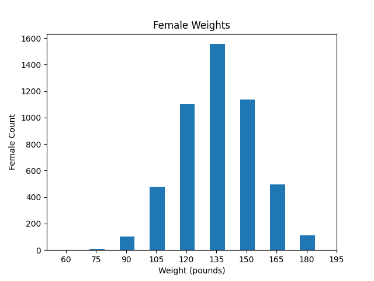
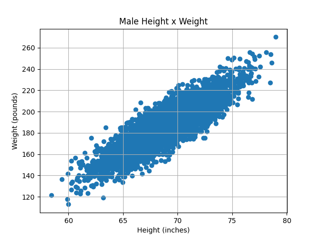

# Activity 09

## Height and Weight Visualization

## Goal
The goal of this activity is to have you 2 visualizations from female (and male) weight and height data. 
 
## Instructions

Finish the to-dos embedded in the code. The output should be similar to:

