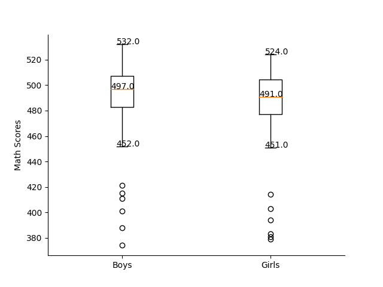

# Activity 10

## Math Scores Box Plot

## Goal
The goal of this activity is to have you produce a box plot of math scores by country, separating boys and girls data. You are also asked to list the countries that have outliers scores (below or above the whiskers). 
 
## Instructions

Finish the to-dos embedded in the code. The output should be similar to:



```
min_whisker_boys: 452.0
max_whisker_boys: 532.0
min_whisker_girls: 451.0
max_whisker_girls: 524.0
*** Outlier Country (boys scores) ***
['MEX', 'BRA', 'CHL', 'IDN', 'COL', 'CRI']
*** Outlier Country (girls scores) ***
['MEX', 'BRA', 'CHL', 'IDN', 'COL', 'CRI']
```
