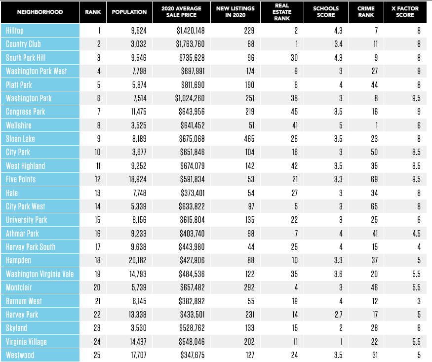
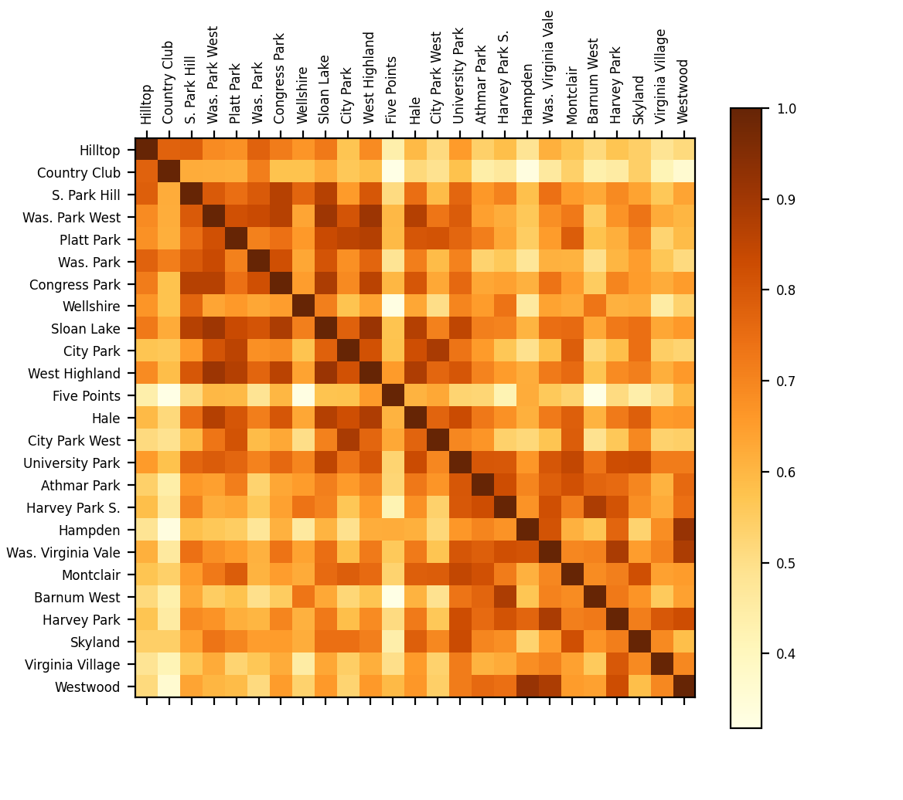

# Activity 11

## Denver Neighborhoods

## Goal
The goal of this activity is to build a grid chart to compare neighborhoods in the Denver metro area. 
 
## Instructions

Begin this activity by scraping the information about neighborhoods in the Denver metro area from [https://www.5280.com/neighborhoods/](https://www.5280.com/neighborhoods/). The information to be extracted can be found in the table below:



Your dataset should be named denver_neighborhoods. We suggest a simple CSV format with the following headers:

```
name,population,home_price,schools_score,crime_rank,x_factor
```

After you have generated the CSV dataset, build a (normalized) data matrix using what you learned in class. Your data matrix should be displayed using a grid chart, similar to the one below. 



Based on the visualization, can you identify the most similar neighborhoods in the Denver metro area? For example, "West Highland" seems to be very similar to "Washington Park West". Indeed, if you look at "West Highland" attributes {population: 9,252, home_price: 674k, school_score: 3.5, crime_rank: 35, x_factor: 8.5} they are very close to "Washington Park West" {population: 7,798, home_price: 697k, school_score: 3, crime_rank: 27, x_factor: 9}. Can you list other neighborhoods that are also very similar? 
