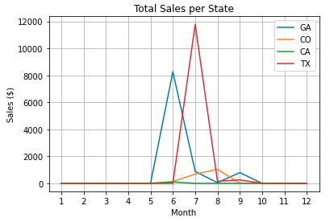

# Activity 13

## Data Cleaning

## Goal
In this activity you will perform common data cleaning tasks on a dataset that includes items and orders.   
 
## Instructions

Create a Jupyter notebook with the following sections: 

### Preamble

Title: *Item & Orders Data Cleaning*

Author: *\<your name\>*

Email: *\<your email\>*

Last Update: *\<date\>*

### Dataset

The dataset for this report consists of 2 collections. One that represents items, having the following structure: 

```
code,description,unit,price,category
```

And another one that contains orders with the following structure:

```
order#,datetime,client,address,city,state,email,code,qtt
``` 

### Data Cleaning

Finish the TO-DO's in data_cleaning.py. 

### Visualization

Present a summary of sales per month in 2021, stratified by state. 




