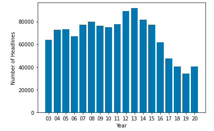
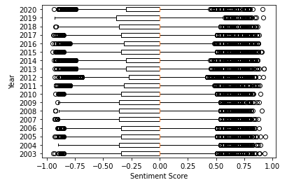

# Activity 25

## Topic Labelling Analysis

The goal of this analysis is to apply NLP techniques to better understand the most commonly discussed topics in Australia during the timeline of 2003-2020. 

## Dataset 

The dataset for this report can be found at [https://www.kaggle.com/therohk/million-headlines](https://www.kaggle.com/therohk/million-headlines). It consists of a CSV of 1,226,258 lines organized in only two columns: publish_date and headline_text. 

## Instructions

Create a jupyter notebook with the following sections. 

* Preamble
* Introduction 
* Dataset
* Summary Statistics
    * Headlines per Year (show the number of news headlines per year, the average and standard deviation of the numbers per year, and a bar plot like the following)

* NLP Analysis
    * News Headline Corpora / Year (create a corpora of headlines stratified by year; to speed-up the analysis you should perform a 5% sample)
    * Top Words / Year (show the top 10 words on a given year)
    * Top Bigrams / Year (show the top 10 bigrams on a given year)
    * Top Topics / Year (show the top 5 topics on a given year; we strongly recommend to use bigrams to get more meaninful topics)
    * Sentiment Fluctuation over the Years (a boxplot similar to the one below)

