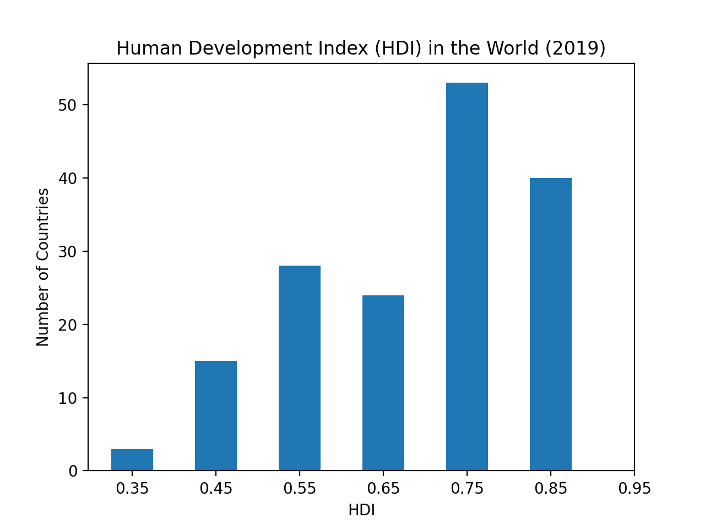

# Homework 03

## HDI

## Goal

To illustrate how to use matplotlib to generate a histogram from a dataset.  

## Instructions 

Parse the hdi.csv dataset that has yearly Human Development Index (HDI) values for a sample of 204 countries. Then produce a histogram similar to the one below that shows the frequency distribution of HDI in the world in 2019. 

Only submit hdi_visualization.py!

