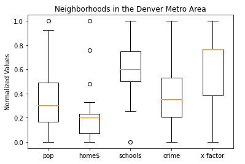

# Homework 04

## Denver Neighborhoods

## Goal

Identify (potential) outliers in a dataset. 

## Instructions 

During the discussions of activity 11 (Denver neighborhoods), the box plot below was generated where 5 data points can be spotted as (potential) outliers. Your goal is to write a program that identifies the name of the neighborhoods associated with those 5 data points. Hint: use the 'whisker' key to query the box plot returned dictionary to find the whiskers lower and upper bounds. 



Expected output of your program: 

```
Hilltop has homes priced much higher compared to others.
Country Club has homes priced much higher compared to others.
Was. Park has homes priced much higher compared to others.
Hampden is much more populated compared to the others.
Virginia Village has a school score average much lower compared to others.
```