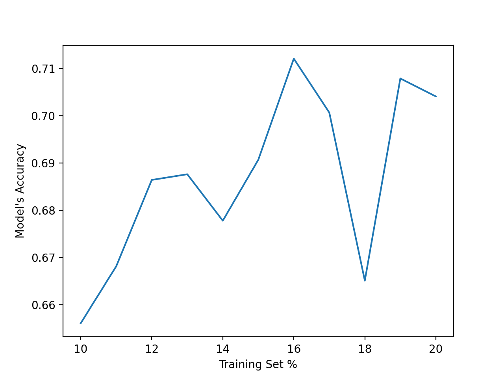

# Homework 06

## Decision Tree

## Goal
Split the diabetes dataset into training (10%) and test (90%).  Then create a decision tree model and compute its accuracy. Does the accuracy of your model changes when you increase the size of your training set? Can you plot a learning curve?

## Instructions

Create a Jupyter notebook with the following sections: 

### Preamble

Title: *Diabetes Data Analysis - Decision Tree Learning*

Author: *\<your name\>*

Email: *\<your email\>*

Last Update: *\<date\>*

### Instructions

Finish the TO-DO's embedded in the code.  Then create a plot that shows how your model's accuracy varies with the size of the training set.  Your plot should look similar to the following: 

