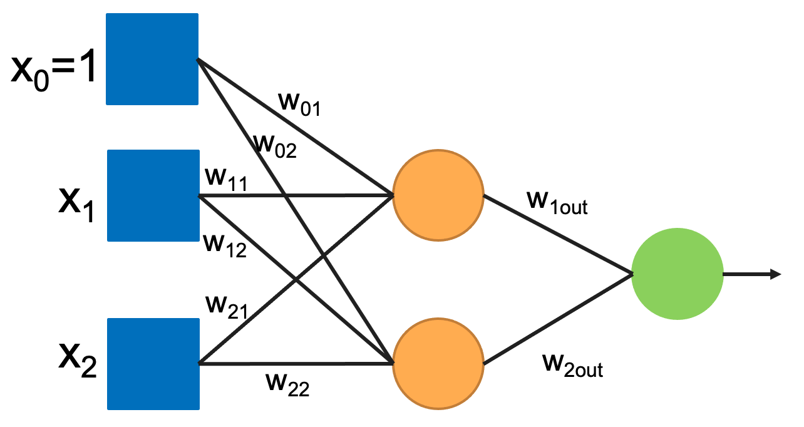

# Homework 07

## XOR ANN Model

## Goal
Implement a XOR ANN using the following architecture. 



## Instructions

Finish the TO-DO's embedded in the code.  Using your model's "coefs_" attribute to determin the weights of your ANN model. Then show that your model produces the correct output for all the possible inputs. Use the following format:

```
x_0 = 1 (always)
x_1 = -1
x_2 = -1
out = ? 

h_1 = x_0w_01 + x_1w_11 + x_2w_21 
h_2 = x_0w_02 + x_1w_12 + x_2w_22

out = h_1w_1out + h_2w_2out 
```

```
x_0 = 1 (always)
x_1 = -1
x_2 = 1
out = ? 

h_1 = x_0w_01 + x_1w_11 + x_2w_21 
h_2 = x_0w_02 + x_1w_12 + x_2w_22

out = h_1w_1out + h_2w_2out 
```

```
x_0 = 1 (always)
x_1 = 1
x_2 = -1
out = ? 

h_1 = x_0w_01 + x_1w_11 + x_2w_21 
h_2 = x_0w_02 + x_1w_12 + x_2w_22

out = h_1w_1out + h_2w_2out 
```

```
x_0 = 1 (always)
x_1 = 1
x_2 = 1
out = ?

h_1 = x_0w_01 + x_1w_11 + x_2w_21 
h_2 = x_0w_02 + x_1w_12 + x_2w_22

out = h_1w_1out + h_2w_2out 
```
## Submission

Submit the python code and the (manual) calculation of the output to prove the correctness of your mode. You can show calculation embedded in the code as comments. 