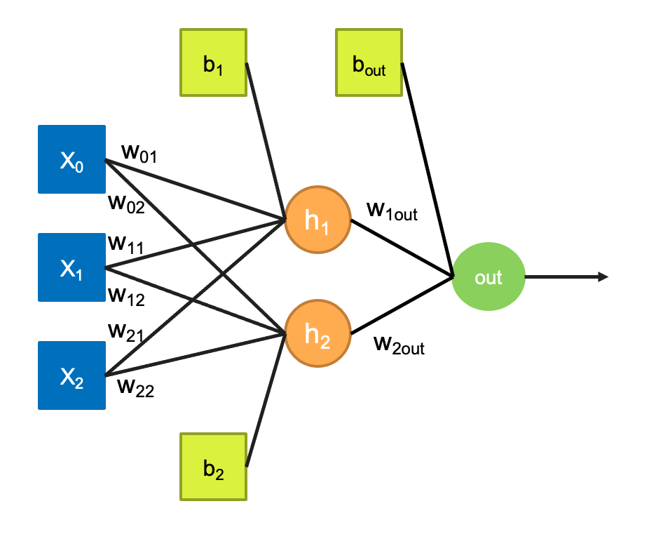

# Homework 07

## XOR ANN Model

## Goal
Implement a XOR ANN using the following architecture. 

## Instructions

Finish the TO-DO's embedded in the code.  Use your model's "coefs_" attribute to determine the weights and "intercepts_" attribute to determine the biases of your ANN model. Then show that your model produces the correct output for all the possible inputs. 

## Submission

Submit the python code xor_model.py