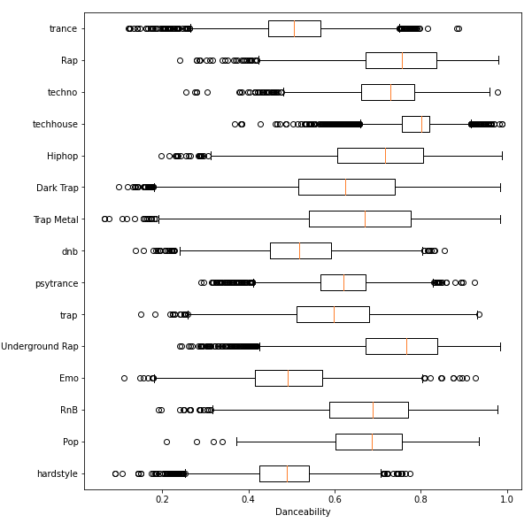

# Programming Assignment 02

## Spotify Song Tracks Classifier

The goal of this analysis is to develop classification models capable of predicting the genre of a song based on measured audio attributes.   

## Dataset 

The dataset for this project is available under 'data' (genres_v2.csv) and it was obtained from [Kaggle](https://www.kaggle.com/mrmorj/dataset-of-songs-in-spotify). It consists of a collection of 42,305 song track from various musical genres, with the following audio attributes:

* danceability
* energy 
* key 
* loudness 
* speechiness 
* acousticness 
* instrumentalness 
* liveness 
* valence 
* tempo 
* duration_ms

The meaning of those audio attributes are described by Spotify [here](https://developer.spotify.com/documentation/web-api/reference/#/operations/get-several-audio-features).

## Requirements 

The data analysis must be presented as a Jupyter notebook with the following (required) sections: 

* Preamble: this is a markdown section containing the title of your project, author(s), contact info (email), and the date when the notebook was last updated. 
* Introduction: a short paragraph written in markdown explaining what is your project about.
* Dataset: also in markdown, this section should describe in detail the dataset that you will be using in this project, explaining any specific terms related to your data collection that most people wouldn't be familiar with; if some field can be classified into categories, explain those in detail and the range of possible values for each category
* Preprocessing: this section should contain one or more markdown text with supporting code explaining how the dataset was processed before the analysis, including attributes removal, attributes enconding, and any transformations perfomed in the original dataset. 
* Summary Statistics: this section should present the python code that displays summary statistics and visuals from each of the attributes of the dataset; at minimum, a histogram and a multi box plot (per genre) should be produce per attribute. 
* Correlation Analysis: do at least one correlation analysis, like comparing speechiness and instrumentalness, for example.  
* Classification: show the code and results of 3 classification models based on decision tree inference, naive Bayes classification, and artificial neural networks; each classification model should be based on a consistent split between training and testing datasets; the accuracy of each model should be displayed; any specific tunning parameter used in a model should be supported by an explanatory text. 

Regarding the meaning of a multi box plot (per genre), see the example below. 

## Submission

Just one members of the team (if working with a partner) needs to submit. 

If you are using Google's Colab, you can submit your project by simply sharing your notebook (read-only is fine) with your instructor (thyagomota@gmail.com). You still need to write me a comment on canvas telling me that you shared your project, listing your gmail account so I can associate the shared notebook to you. 

If you are NOT using Google's Colab, or you don't want to share through google, you can just download your notebook and upload it on canvas. 

## Rubric

\+5 preamble section

\+10 introduction section

\+10 dataset section

\+15 preprocessing section

\+25 summary statistics section

\+5 correlation analysis sectioon

\+30 classification sectionn

\+10 bonus points (a 4th classification model of your choice)
